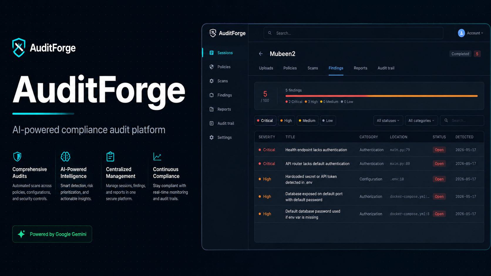

# AuditForge

AuditForge is a compliance audit platform for enterprise systems. It helps users create audit
sessions, upload artifacts, select compliance policy packs, run AI-powered scans, review findings,
and export signed reports for frameworks such as HIPAA, SOC 2, and OWASP.



Frontend repository: [github.com/zeeshanali-k/AuditForge](https://github.com/zeeshanali-k/AuditForge)

Backend repository: [github.com/mubeen-afzal/AuditForge](https://github.com/mubeen-afzal/AuditForge)

## Project Scope

This repository contains the AuditForge frontend client. The app is built with Kotlin
Multiplatform and Compose Multiplatform, targeting Desktop JVM and Web/Wasm. It talks to the
AuditForge backend through the REST API defined in [API_SPECIFICATION.md](API_SPECIFICATION.md).

The backend stack for the project uses **FastAPI** for the API layer and **LangGraph** for the
AI-powered audit workflow orchestration.

## Features

- Authentication with JWT bearer tokens
- Audit session creation, listing, details, and deletion
- Artifact uploads for codebases, APIs, database configs, and cloud configurations
- Policy pack selection for compliance frameworks
- Scan execution with live progress events
- Findings review, filtering, triage, and remediation details
- Signed report generation and download
- Audit trail viewing and integrity verification

## Tech Stack

- **Frontend:** Kotlin Multiplatform, Compose Multiplatform
- **Targets:** Desktop JVM and Web/Wasm
- **Networking:** Ktor Client
- **State & async:** Kotlin coroutines, MVI-style single UI state
- **Serialization:** kotlinx.serialization
- **Dependency injection:** Koin
- **Backend:** FastAPI, LangGraph
- **API:** REST, JSON, multipart uploads, SSE progress streams

## Run Locally

```bash
# Desktop development
./gradlew :composeApp:run

# Web development
./gradlew :composeApp:wasmJsBrowserDevelopmentRun

# Run tests
./gradlew :composeApp:allTests
```

The local API base URL is documented as:

```text
http://localhost:8080/api/v1
```

## Documentation

- [API_SPECIFICATION.md](API_SPECIFICATION.md) describes the REST API contract.
- [CLAUDE.md](CLAUDE.md) contains the frontend project plan, stack notes, and implementation phases.
